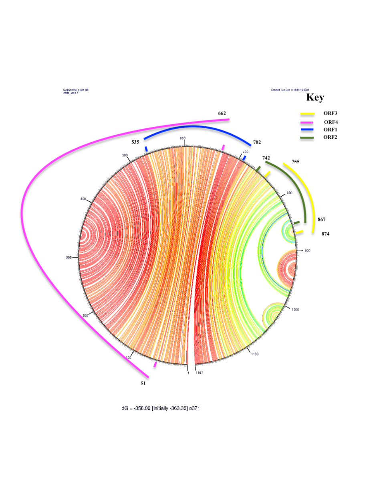

# {Q1A Paper Title}
written by: [Caitlin Oxley](https://github.com/yourname *optional link*)

### {Q1B Virus Name}
Turning Crap Into Clues: The Curious Case of Obelisk 371

[Optional: Tutorial 2 Generative AI Cover-art](img/<virusname>/cover.png)


## Abstract

In 2024, a groundbreaking study described a new class of heritable RNA elements called obelisks, primarily found in human stool and oral metatranscriptomes (Zheludev et al., 2024). These intriguing RNA elements appear to be ubiquitous. In this study, we focused specifically on Obelisk 371, which was identified across three continents and in diverse host species. This prompted the central questions: where else can Obelisk 371 be found, and what exactly is its biological role? To address these, we utilized a range of bioinformatics tools to analyze available datasets. Key findings include the identification of conserved sequence motifs, the frequent presence of Obelisk 371 in fecal samples, and a notable connection to Haemophilus influenzae Rd KW20. While most of the data were obtained with low confidence, our results highlight the potential significance of Obelisk 371 and underscore the need for further exploration into its ecology, evolution, and functional roles. 

## Results

### Ecology subsection A...

Digital ecology

Dataset Overview
Obelisk 371 was found in eight samples distributed across three different datasets.
The sequencing run accessions and associated BioProjects are as follows:

BioProject PRJNA49566: SRR8048115, SRR8048116, SRR8048120, SRR8048121 and SRR8048122. While
BioProject PRJEB6505: ERR1301135 and ERR1301197
BioProject PRJEB62473: ERR11485294
These data sets provide a diverse and ecological of analysis for Obelisk 371

Bioproject Studies and Ecologies

PRJNA49566 (Australia)

Samples from this BioProject were derived from the gut metagenome of Tasmanian devils (Sarcophilus harrisii). This study, conducted by the University of Australia, focused on characterizing the faecal virome of this endangered species using viral-like particle (VLP) metagenomics and meta-transcriptomics. Sequencing was performed with the Illumina NextSeq 500 platform, with the broader aim of understanding the eukaryotic viral communities that could impact the conservation of Tasmanian devils.(Chong et al. 2019)

PRJEB6505 (Vietnam)

This BioProject is part of the Vietnam Initiative on Zoonotic Infections (VIZIONS), which investigates zoonotic pathogens and viral populations. High-throughput sequencing with the Illumina HiSeq 2500 platform was employed to characterize viral diversity. While the host organisms are not explicitly detailed, the study focuses on populations in close contact with animals, suggesting a zoonotic or gut-associated viral origin.(Rabaa et al. 2015)

PRJEB62473 (United Kingdom)

This BioProject consists of metagenomic and metatranscriptomic data from human stool samples. Sequencing was performed using the Illumina HiSeq 4000 platform, with the study aiming to identify pathogens in symptomatic patients. This dataset provides insights into the gut microbiota and pathogen diversity in humans, offering a clinical perspective on viral ecology.

Comparative Ecology

Commonalties
Despite differences in geographic origin and host species, There are some common features emerging from datasets:

Host Class:
All datasets involve mammalian hosts, with at least two (PRJEB62473 and PRJNA49566) explicitly focusing on gut-associated viral communities.

Sequencing Technology:
High-throughput sequencing with Illumina platforms was consistently utilized to enable detailed viral characterization.

Health concern:
All three data sets originated for from the concern of health in 3 different populations and wanted to see if it had pathogenic

Differences
The datasets also exhibit several notable differences:

Geographic Diversity:
Samples were collected from three continents—Australia, Asia (Vietnam), and Europe (United Kingdom)—representing distinct ecosystems.

Host Organisms:
Host species range from the Tasmanian devil (Sarcophilus harrisii) in Australia to humans in the UK, with the Vietnam dataset likely involving animal hosts linked to zoonotic transmission.

Ecosystem Biodiversity:
Australia and Vietnam are biodiversity hotspots, whereas the UK represents a more basic ecosystem, offering contrasting contexts for viral ecology.

Therefore, It can be hypothesized that Obelisk 371 is conserved between different hosts and environments and there should be seen in other data besides these 3 sources.

### Virus Genome {Q3}




### Other (bonus) sections


## Discussion

In this project I have learnt many things about obelisks 371, and with the more that I have learnt the less I seem to know. Thus, relaying the message that obelisk have offer a huge gap of research. The main facts learnt about this obelisk is that it is very diverse and found in numerous populations but mainly gut. Using Pebble scout, which allows you to search large nucleotide bases of metagenomic runs released to the public before the end of 2021. In this project, I will discuss only discuss those with more than 80% identity as this offers a higher confidence that Obelisk 371 is in the data sets. This produced 3 additional run accessions from 3 different bioProjects and all from the human gut mentagenome.

PRJNA398089:
studied the gut metagenome in those with inflammatory bowl disease of 100 subjects sampled twice a week using multiple analyses including fecal metagenomes, metatranscriptomes, metabolomes, and proteome. (Zhang et al. 2022 May 25)

PRJEB25404:
used a metatranscriptomic approach to analyze the gut microbiota and gene expression patterns in a cohort of mothers and infants throughout the first year of life, including maternal microbiota samples collected before delivery and one year postpartum, to identify stage-specific patterns of microbiome function. (María José Gosalbes et al. 2019)

PRJNA407499:
evaluated the impact of oral typhoid vaccines (Ty21a and M01ZH09) on the gut microbiota and immune responses by analyzing longitudinal fecal samples from healthy adults, who were vaccinated, challenged with S. Typhi, and monitored for clinical symptoms and microbiological changes, using 16S rRNA and metatranscriptomic analyses to explore the relationship between vaccine-induced immunity and gut microbiota dynamics. (Zheng et al. 2019)

From these datasets, one can conclude with low confidence  that Obelisk 371 is found in the human gut metagenome, although further research is required to confirm this with higher certainty. More confidently, it is clear that Obelisk 371 is present in diverse populations, underscoring its widespread distribution. Like other obelisks, it is circular in structure and encodes for obelin, a characteristic trait that is shared across its family.


## References
Altschul S. 1997. Gapped BLAST and PSI-BLAST: a new generation of protein database search programs. Nucleic Acids Research. 25(17):3389–3402. doi:https://doi.org/10.1093/nar/25.17.3389.

Altschul SF, Wootton JC, Gertz EM, Agarwala R, Morgulis A, Schaffer AA, Yu Y-K. 2005. Protein database searches using compositionally adjusted substitution matrices. FEBS Journal. 272(20):5101–5109. doi:https://doi.org/10.1111/j.1742-4658.2005.04945.x.

Bailey TL, Elkan C. 1994. Fitting a mixture model by expectation maximization to discover motifs in biopolymers. PubMed. 2:28–36.

Chong R, Shi M, Grueber CE, Holmes EC, Hogg CJ, Belov K, Barrs VR. 2019. Fecal Viral Diversity of Captive and Wild Tasmanian Devils Characterized Using Virion-Enriched Metagenomics and Metatranscriptomics. López S, editor. Journal of Virology. 93(11). doi:https://doi.org/10.1128/jvi.00205-19.

Gruber AR, Lorenz R, Bernhart SH, Neubock R, Hofacker IL. 2008. The Vienna RNA Websuite. Nucleic Acids Research. 36(Web Server):W70–W74. doi:https://doi.org/10.1093/nar/gkn188.

Home - SRA - NCBI. wwwncbinlmnihgov. https://www.ncbi.nlm.nih.gov/sra.

Huson DH, Richter DC, Rausch C, Dezulian T, Franz M, Rupp R. 2007. Dendroscope: An interactive viewer for large phylogenetic trees. BMC Bioinformatics. 8(1). doi:https://doi.org/10.1186/1471-2105-8-460.

Jumper J, Evans R, Pritzel A, Green T, Figurnov M, Ronneberger O, Tunyasuvunakool K, Bates R, Žídek A, Potapenko A, et al. 2021. Highly Accurate Protein Structure Prediction with Alphafold. Nature. 596(7873):583–589. doi:https://doi.org/10.1038/s41586-021-03819-2. https://www.nature.com/articles/s41586-021-03819-2.

Madeira F, Nandana Madhusoodanan, Lee J, Eusebi A, Ania Niewielska, Tivey ARN, Lopez R, Butcher S. 2024. The EMBL-EBI Job Dispatcher sequence analysis tools framework in 2024. Nucleic acids research. 52(W1). doi:https://doi.org/10.1093/nar/gkae241.

María José Gosalbes, Compte J, Moriano‐Gutierrez S, Vallès Y, Nuria Jiménez‐Hernández, Pons X, Artacho A, M. Pilar Francino. 2019. Metabolic adaptation in the human gut microbiota during pregnancy and the first year of life. EBioMedicine. 39:497–509. doi:https://doi.org/10.1016/j.ebiom.2018.10.071.

Minh BQ, Schmidt HA, Chernomor O, Schrempf D, Woodhams MD, von Haeseler A, Lanfear R. 2020. IQ-TREE 2: New Models and Efficient Methods for Phylogenetic Inference in the Genomic Era. Teeling E, editor. Molecular Biology and Evolution. 37(5):1530–1534. doi:https://doi.org/10.1093/molbev/msaa015. https://academic.oup.com/mbe/article/37/5/1530/5721363.

National Library of Medicine. 2024. National center for biotechnology information. Nihgov. https://www.ncbi.nlm.nih.gov/.
NCBI. 2019. ORFfinder - NCBI. Nihgov. https://www.ncbi.nlm.nih.gov/orffinder/.

Rabaa MA, Ngo Tri Tue, Tran My Phuc, Carrique-Mas J, Saylors K, Cotten M, Bryant JE, Ho, Nguyen Van Cuong, Hong-Anh Thi Pham, et al. 2015. The Vietnam Initiative on Zoonotic Infections (VIZIONS): A Strategic Approach to Studying Emerging Zoonotic Infectious Diseases. Ecohealth. 12(4):726–735. doi:https://doi.org/10.1007/s10393-015-1061-0. [accessed 2023 Jun 25]. https://pmc.ncbi.nlm.nih.gov/articles/PMC4700077/.

Shiryev SA, Agarwala R. 2024. Indexing and searching petabase-scale nucleotide resources. Nature Methods. 21(6):994–1002. doi:https://doi.org/10.1038/s41592-024-02280-z.

Zhang Y, Bhosle A, Bae S, McIver LJ, Pishchany G, Accorsi EK, Thompson KN, Arze C, Wang Y, Subramanian A, et al. 2022 May 25. Discovery of bioactive microbial gene products in inflammatory bowel disease. Nature.:1–7. doi:https://doi.org/10.1038/s41586-022-04648-7. [accessed 2022 May 30]. https://www.nature.com/articles/s41586-022-04648-7.

Zheludev IN, Edgar RC, Lopez-Galiano MJ, de la Peña M, Babaian A, Bhatt AS, Fire AZ. 2024. Viroid-like colonists of human microbiomes. Cell. 187(23):6521-6536.e18. doi:https://doi.org/10.1016/j.cell.2024.09.033. https://www.sciencedirect.com/science/article/abs/pii/S0092867424010912.
Zheng W, Ma Y, Zhao A, He T, Lyu N, Pan Z, Mao G, Liu Y, Li J, Wang P, et al. 2019. Compositional and functional differences in human gut microbiome with respect to equol production and its association with blood lipid level: a cross-sectional study. Gut Pathogens. 11(1). doi:https://doi.org/10.1186/s13099-019-0297-6.
# Viral Short Story

```
Once upon a time, in the wilds of Tasmania, a mysterious discovery was made by researchers studying the endangered Tasmanian devils, whose faces were plagued by a deadly affliction known as Devil Facial Tumor Disease (DFTD). This strange cancer caused fatal tumors to grow upon the devils’ faces, puzzling scientists for years.
In their efforts to understand the disease, researchers delved into the hidden world of viruses using powerful tools like VLP metagenomics and meta-transcriptomics. Among the known viruses they uncovered, one stood out— obelisk_371. This enigmatic entity, unlike any other, seemed to hold a deeper secret. Could obelisk_371 be tied to the devils' curse, marking them with a unique distinction? The answer was unclear, but the mystery deepened.
Further investigation revealed that obelisk_371 had appeared not only in the devils but also in nine separate samples of metagenomic data, including that of the human gut microbiome. Even more curious, it had been found exclusively in two distant lands—the United Kingdom and Australia—both far removed from each other.
Whispers spread that obelisk_371 was a virus, its viral nature adding to its cryptic allure. What purpose does it serve? Could it be linked to the Tasmanian devils' affliction, or is there something more at play? Only time and further study would reveal its secrets.
Thus, the tale of obelisk_37* unfolds—a riddle entwined with the devils, the human world, and the unseen forces that shape life itself. The answers remain elusive, waiting to be uncovered by those daring enough to follow the clues.
```